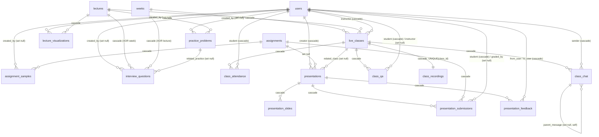

# Schema enhancement — learning content, live classes, presentations

Migration `src/db/migrations/0006_narrow_deathbird.sql`, branch
`feature/lms-complete-enhancement`. Thirteen new tables in three sibling schema
modules, plus seventeen additive nullable/defaulted columns on three existing
tables.

Sources: `TECHNICAL_SPECIFICATION.md` §1,
`LIVE_CLASSES_PRESENTATIONS_TECHNICAL_SPEC.md` §1.2,
`LIVE_CLASSES_AND_PRESENTATIONS_STRATEGY.md` §2.4 and §3.4.

| Module | Tables |
|---|---|
| `src/db/schema.learning.ts` | `assignment_samples`, `practice_problems`, `interview_questions`, `lecture_visualizations` |
| `src/db/schema.live-classes.ts` | `live_classes`, `class_attendance`, `class_chat`, `class_qa`, `class_recordings` |
| `src/db/schema.presentations.ts` | `presentations`, `presentation_slides`, `presentation_submissions`, `presentation_feedback` |

All three are registered in `drizzle.config.ts`'s `schema` array. **An unlisted
module is a set of tables drizzle-kit offers to DROP** — that array is the one
place a mistake here destroys data.

Verified against the live Neon database after `npm run db:migrate`:
13/13 tables present, 34 CHECK constraints, 62 indexes (including primary keys
and unique constraints).

---

## 1. Entity relationships



ASCII summary of the three clusters and their attachment points into the frozen
Wave 0 seam (`src/db/schema.ts`):

```
                    ┌──────────── src/db/schema.ts (FROZEN SEAM) ────────────┐
                    │  users   courses   weeks   lectures   assignments      │
                    │            questions   submissions                     │
                    └───┬─────────┬──────────┬──────────────┬────────────────┘
                        │         │          │              │
  LEARNING ─────────────┼─────────┼──────────┼──────────────┼──────────────
   assignment_samples ──┘         │          │              │
   practice_problems ─────────────┼──────────┘              │
     └─ interview_questions ──────┤ (lecture XOR week)      │
   lecture_visualizations ────────┘                         │
                                                            │
  LIVE CLASSES ─────────────────────────────────────────────┼──────────────
   live_classes ── week / lecture / instructor ─────────────┘
     ├─ class_attendance   UNIQUE(class_id, student_id)
     ├─ class_chat         (self-referencing thread)
     ├─ class_qa
     └─ class_recordings   UNIQUE(class_id)   ← 1:1
                                                            │
  PRESENTATIONS ────────────────────────────────────────────┼──────────────
   presentations ── creator / assignment / related_class ───┘
     ├─ presentation_slides       UNIQUE(presentation_id, slide_number)
     ├─ presentation_submissions  UNIQUE(assignment_id, student_id)
     └─ presentation_feedback
```

---

## 2. Tables, column counts and purpose

| Table | Cols | Purpose |
|---|---:|---|
| `assignment_samples` | 14 | Worked examples shown before an assignment: preview, code files, live link |
| `practice_problems` | 20 | Scaffolded per-lecture exercises: context, hints ladder, reference solution |
| `interview_questions` | 19 | Interview prep attached to a lecture **or** a week (exclusive) |
| `lecture_visualizations` | 17 | SVG diagrams, animation specs and interactive configs per lecture |
| `live_classes` | 24 | A scheduled → live → ended session, with its Jitsi room and settings |
| `class_attendance` | 11 | One row per (class, student); presence minutes and engagement counters |
| `class_chat` | 10 | Session chat, soft-deleted, one level of threading |
| `class_qa` | 11 | Questions with an answer lifecycle and upvotes |
| `class_recordings` | 14 | At most one recording artefact per class; soft-deleted |
| `presentations` | 20 | A slide deck: editor document plus sharing and stats |
| `presentation_slides` | 14 | Queryable per-slide projection of that document |
| `presentation_submissions` | 16 | A deck submitted for an assignment, plus its grade |
| `presentation_feedback` | 10 | Peer / instructor / self comments and 1-5 ratings |

### Additive columns on frozen tables

`src/db/schema.ts` is the Wave 0 seam and is not restructured here. A column
cannot live outside its table, so these seventeen were appended in place under
`// --- learning-enhancement wave ---` markers, following the existing add-on
wave precedent (`lectures.topic_key`, `questions.points`, `questions.tests`).
Every one is nullable or defaulted, so no existing query, insert or inferred type
changes.

| Table | Added |
|---|---|
| `lectures` | `learning_objectives`, `estimated_duration_minutes`, `difficulty_level`, `visualizations_count`, `practice_problems_count`, `is_enhanced` |
| `assignments` | `samples_count`, `functional_requirements`, `acceptance_criteria_visual`, `rubric_with_examples`, `sample_screenshots`, `is_enhanced` |
| `questions` | `explanation_html`, `correct_breakdown`, `incorrect_analysis`, `deeper_learning_resources`, `is_enhanced` |

The four new `questions` content columns are **answer-key material** and must be
stripped from any pre-submit payload, exactly like `questions.tests` and
`options.is_correct` already are.

---

## 3. Indexes, and the query each one serves

### `assignment_samples`
| Index | Serves |
|---|---|
| `assignment_samples_assignment_idx` (assignment_id) | the samples of one assignment |
| `assignment_samples_created_at_idx` (created_at) | admin "recently authored content" |
| `assignment_samples_order_idx` UNIQUE (assignment_id, sample_order) | one sample per position; ON CONFLICT target for re-seeding |

### `practice_problems`
| Index | Serves |
|---|---|
| `practice_problems_lecture_idx` (lecture_id) | the practice set of one lecture |
| `practice_problems_difficulty_idx` (difficulty_level) | "practice by difficulty" filter |
| `practice_problems_order_idx` UNIQUE (lecture_id, problem_order) | one problem per position |

### `interview_questions`
| Index | Serves |
|---|---|
| `interview_questions_lecture_idx` (lecture_id) | lecture-scoped questions |
| `interview_questions_week_idx` (week_id) | week-scoped questions |
| `interview_questions_difficulty_idx` (difficulty_level) | difficulty filter |
| `interview_questions_lecture_order_idx` UNIQUE PARTIAL (lecture_id, question_order) WHERE lecture_id IS NOT NULL | ordering, lecture half |
| `interview_questions_week_order_idx` UNIQUE PARTIAL (week_id, question_order) WHERE week_id IS NOT NULL | ordering, week half |

The two order indexes are **partial** on purpose: in Postgres every NULL is
distinct, so a plain `UNIQUE(lecture_id, question_order)` would not constrain the
week-scoped rows at all.

### `lecture_visualizations`
| Index | Serves |
|---|---|
| `lecture_visualizations_lecture_idx` (lecture_id, order_index) | render one lecture's figures in order |
| `lecture_visualizations_topic_idx` (topic_key) | cross-lecture "every diagram for this concept" |
| `lecture_visualizations_order_idx` UNIQUE (lecture_id, order_index) | one figure per position |

### `live_classes`
| Index | Serves |
|---|---|
| `live_classes_week_idx` (week_id) | the classes on a week page |
| `live_classes_instructor_idx` (instructor_id) | "my classes" |
| `live_classes_status_idx` (status) | "is anything live right now?" |
| `live_classes_scheduled_idx` (scheduled_at) | time-range scan for the calendar |
| `live_classes_status_scheduled_idx` (status, scheduled_at) | `GET /api/classes/upcoming`: status='scheduled' ORDER BY scheduled_at |
| `live_classes_recording_status_idx` (recording_status) | "recordings available" |

### `class_attendance`
| Index | Serves |
|---|---|
| `class_attendance_class_student_idx` UNIQUE (class_id, student_id) | **the** constraint: one attendance row per pair; ON CONFLICT target for join |
| `class_attendance_class_idx` (class_id) | the roster of one class |
| `class_attendance_student_idx` (student_id) | a student's attendance across the term |
| `class_attendance_class_joined_idx` (class_id, joined_at) | roster by arrival; "who is still here?" |

### `class_chat`
| Index | Serves |
|---|---|
| `class_chat_class_created_idx` (class_id, created_at) | the transcript — live tail and replay |
| `class_chat_sender_idx` (sender_id) | moderation: everything one account posted |
| `class_chat_parent_idx` (parent_message_id) | the replies to a message |

### `class_qa`
| Index | Serves |
|---|---|
| `class_qa_class_created_idx` (class_id, created_at) | the Q&A panel, newest first |
| `class_qa_class_unanswered_idx` (class_id, is_answered, upvotes) | the instructor's working queue, polled continuously |
| `class_qa_student_idx` (student_id) | "my questions" |

### `class_recordings`
| Index | Serves |
|---|---|
| `class_recordings_class_idx` UNIQUE (class_id) | at most one recording per class; ON CONFLICT target for the ingest job |
| `class_recordings_public_created_idx` (is_public, created_at) | the public recordings gallery |

### `presentations`
| Index | Serves |
|---|---|
| `presentations_creator_idx` (creator_id) | "my presentations" |
| `presentations_assignment_idx` (assignment_id) | decks submitted for one assignment |
| `presentations_published_idx` (is_published) | the gallery |
| `presentations_template_idx` (is_template) | the builder's template picker |
| `presentations_related_class_idx` (related_class_id) | decks shown in one class |
| `presentations_published_at_idx` (is_published, published_at) | gallery default ordering |

### `presentation_slides`
| Index | Serves |
|---|---|
| `presentation_slides_number_idx` UNIQUE (presentation_id, slide_number) | one slide per number; ON CONFLICT target for the save handler |
| `presentation_slides_presentation_idx` (presentation_id) | load the deck in order |

### `presentation_submissions`
| Index | Serves |
|---|---|
| `presentation_submissions_assignment_student_idx` UNIQUE (assignment_id, student_id) | one submission per student per assignment; resubmit replaces |
| `presentation_submissions_student_idx` (student_id) | "my submissions" |
| `presentation_submissions_assignment_idx` (assignment_id) | the grading queue |
| `presentation_submissions_assignment_status_idx` (assignment_id, status, submitted_at) | the queue's real filter: ungraded, oldest first |
| `presentation_submissions_presentation_idx` (presentation_id) | "has this deck been submitted anywhere?" |

### `presentation_feedback`
| Index | Serves |
|---|---|
| `presentation_feedback_presentation_created_idx` (presentation_id, created_at) | the feedback panel on a deck |
| `presentation_feedback_to_user_idx` (to_user_id) | feedback I have received |
| `presentation_feedback_from_user_idx` (from_user_id) | feedback I have given |
| `presentation_feedback_type_idx` (feedback_type) | "instructor feedback only" |

### On the frozen tables
`lectures_enhanced_idx` (is_enhanced) — the admin's "which lectures still need
enhancing?" worklist.

---

## 4. Constraints pushed into the database

Thirty-four CHECK constraints, on the principle that a rule expressible in SQL
should not be a property of application code that four call sites can each get
wrong. Grouped by what they prevent:

**Ordering.** `*_order_non_negative` on all four learning tables;
`presentation_slides_number_positive` (slide numbers are 1-based).

**Exclusive parentage.** `interview_questions_exactly_one_parent` —
`(lecture_id IS NULL) <> (week_id IS NULL)`. Neither set is an orphan nothing can
list; both set is a row that appears twice with no way to tell it is the same row.

**Time ranges that run forwards.** `live_classes_ends_after_starts`,
`class_attendance_left_after_joined`, `class_chat_edited_after_created`,
`class_qa_answered_after_asked`, `class_recordings_ends_after_starts`,
`presentation_submissions_graded_after_submitted`. An inverted range is not a
display bug — durations are computed from these columns.

**Non-negative counters and durations.** `live_classes_duration_positive`,
`live_classes_attendance_non_negative`, `live_classes_max_participants_positive`,
`class_attendance_time_present_non_negative`,
`class_attendance_counters_non_negative`, `class_qa_upvotes_non_negative`,
`class_recordings_size_non_negative`, `class_recordings_duration_non_negative`,
`presentations_counters_non_negative`,
`presentation_submissions_duration_non_negative`,
`presentation_submissions_audience_non_negative`,
`lecture_visualizations_size_positive`. Every one of these counters is
incremented by concurrent handlers, and a double-fired decrement is the normal
way a counter goes negative.

**Bounded scores.** `live_classes_engagement_in_range` (0-100),
`class_attendance_participation_in_range` (0-100),
`presentation_submissions_score_in_range` (0-100),
`presentation_feedback_rating_in_range` (1-5).

**Self-consistency of flag/timestamp pairs.** `class_qa_answered_consistent`
(`answered_at IS NOT NULL` = `is_answered`), `presentations_published_consistent`,
`presentation_submissions_grade_consistent` (a grade is whole or absent, never
half-written).

**Identity rules.** `class_chat_no_self_parent` (a reply to itself is an infinite
loop in the renderer); `presentation_feedback_self_typed`
(`from_user = to_user` iff `feedback_type = 'self'`, so a student's own five stars
cannot be counted as a peer's).

**Format.** `presentation_slides_hex_colors` — `#rrggbb` or NULL, enforced by
Postgres because these strings are interpolated into inline styles.

---

## 5. New enums

`class_status`, `recording_status`, `message_type`,
`presentation_submission_type`, `presentation_feedback_type`.

Three existing enums are **reused** rather than duplicated: `proficiency_level`
(difficulty on lectures, practice problems, interview questions),
`execution_mode` (practice problems), `submission_status` (presentation
submissions). A second spelling of "graded" or "beginner" is a filter that
silently returns nothing.

---

## 6. Known gaps

- `src/db/index.ts` passes only `./schema` to `drizzle(pool, { schema })`, so the
  relational query builder (`db.query.liveClasses`) does not see these tables.
  This matches every existing sibling module (peer-review, forums, notifications
  …); those streams use explicit `select()` + `join()`. Changing it is a seam
  change owned by shared-contracts, not this stream.
- No seed data. Content authoring for these tables is a later subagent's work.
- Denormalized counters (`attendance_count`, `visualizations_count`,
  `practice_problems_count`, `samples_count`, `view_count`,
  `presentation_count`) have no maintaining trigger; the handlers that write them
  are owned by the backend subagent. They are display hints only — never an
  authorization or completeness input — so drift degrades a badge and nothing
  else.
